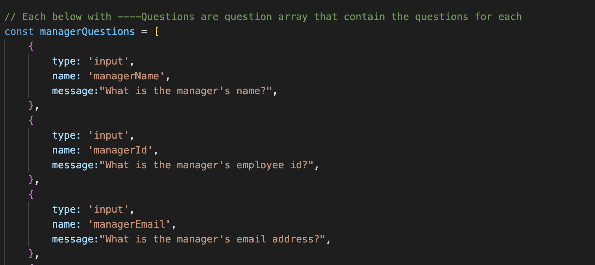
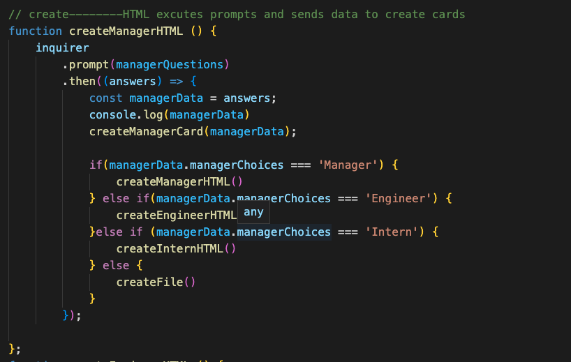
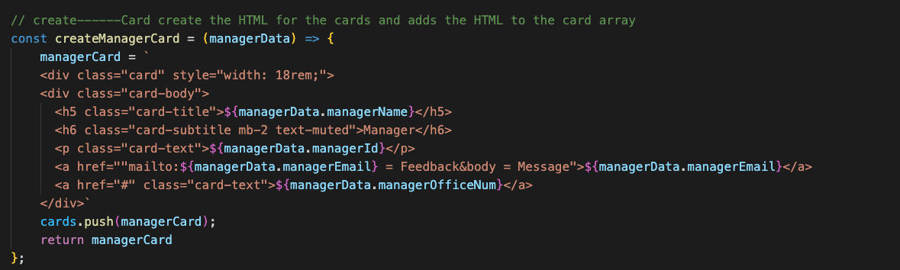
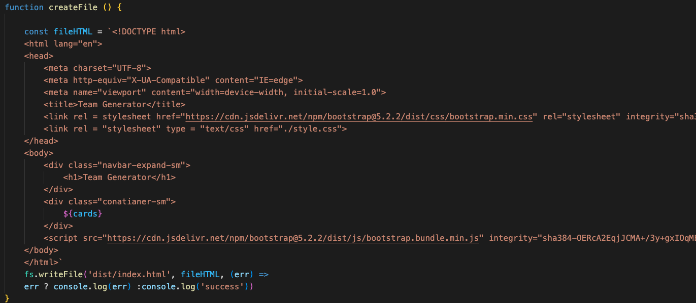

## Table of Contents
* [License](*License)
* [Title](*Title)
* [Description](*Description)
* [Installation](*Installation)
* [Usage](*Usage)
* [Contribution](*Contribution)
* [Test](*Test)
* [Technologies](*Technologies)
* [Questions](*Questions)
* [Spot-Light](*Spot-Light)

## License

# Team Generator 
### Grant Ellington
## Description

This program creates a webpage that shoes important imformation about the team members including link emails. and link sto github accounts. 

## Installation

YOu can colone the repo and run the program with node index.js in the terminal.

## Usage Information

null

## Contribution Guidlines
See the questions and contact the creator.

## Test

Tested with Jest.

## Techonologies
Project is created with:
* JavaScript
* NPM Inquirer
* Jest
## Set-up

To set up, clone the repository and run index.js in the terminal, you can access the file in Visual Studio Code. 

## Questions

Grant-Ellington
[gellingtonem6@gmail.com](gellingtonem6@gmail.com)

## Spot-Light

Below shows the questions array that uses inquirer to go threw the questions.

Below shows the function that runs through the prompted questions, then takses the answers and runs them through the next function. 

The below function takes the answers, adds them to a template literal, and then takes the HTML block and adds it to the cards array.

Below shows the functio which generates the HTML fu

https://user-images.githubusercontent.com/109107643/195157079-a4efa85c-70d6-4a21-99fe-8f6ab7f71b8e.mov

nction.

